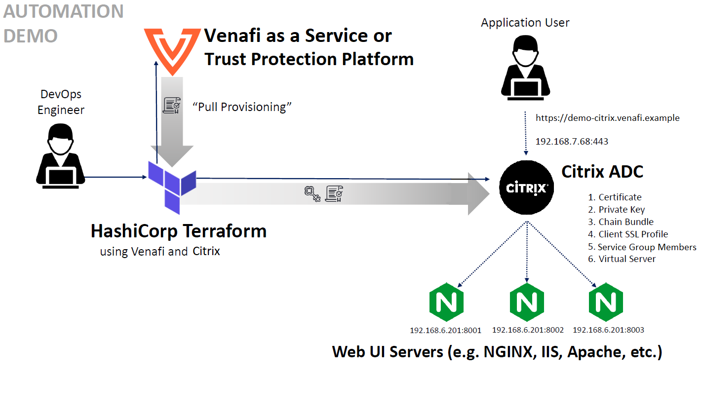

# Configuring secure application delivery using Citrix ADC and the _Venafi Provider for HashiCorp Terraform_

**DW:** Luis, great job on working through this example. I want to provide some general feedback from a technical writer/User Assistance viewpoint in hopes of suggesting ways you can clarify concepts that help users move quickly to the desired outcome. I'll use my initials whereever I make general comments. I'll create a branch for the remainder of my comments so that I can freely change content in addition to adding my comments. Please let me know if you have questions. 

This example will guide you in mounting a [CITRIX-ADC](https://www.citrix.com/products/citrix-adc/) instance and make certificates for those sites using Venafi's product [HashiCorp Terraform](https://terraform.io/) implementation in order to provide [SSL termination](https://www.techwalla.com/articles/what-is-ssl-termination).

## Personas

The steps described in this example are typically performed by a **DevOps engineer** or **Systems Administrator**.

## Scenario

In order to increase reliability and capacity of applications, an Application Delivery Controller(ADC) manages web traffic of your server application into nodes in order to reduce the "weight load" of those applications.

For this example's scenario, we will be using Citrix ADC for managing 3 HTTP servers as nodes where the web traffic will be distributed.

## Solution

Using Terraform "infrastructure as code" automation process for generating and installing a certificate and adding the corresponding configuration to achieve a SSL termination for handling a load balancing of a cluster of 3 HTTP servers.

We will divide the process in the following steps:

> **_Note:_**  These steps are providing a suggested Terraform file structure for this example only but you could still use the same configuration of your preference.

1. Create your Terraform variables file.
2. Set you main Terraform config file.
3. Set your Venafi Terraform config file.
4. Set your Citrix Terraform config file.
5. Apply your setup.

## Prerequisites

To perform the tasks described in this example, you'll need:

- Have [Terraform properly installed](https://learn.hashicorp.com/tutorials/terraform/install-cli).
- Access to either **Venafi Trust Protection Platform (TPP)** or **Venafi Cloud services** (In TPP use case, unless you have administrative access, you'll need to generate an access token from the [VCert CLI](https://github.com/Venafi/vcert/blob/master/README-CLI-PLATFORM.md) as mentioned in [here](https://github.com/Venafi/terraform-provider-venafi#trust-between-terraform-and-trust-protection-platform)).
- Administration access to the Citrix ADC instance.
- A set of 3 NGINX servers running your application.
- Citrix Terraform SDK installed locally following instructions provided [here](./../base/README.md).

## Scenario Introduction

As for this example scenario, you'll generate a certificate for ``demo-citrix.venafi.example`` using this Venafi Provider for Hashicorp Terraform and also using either **Venafi Trust Protection Platform (TPP)** or **Venafi Cloud**. Thus adding them to your Citrix ADC resources, then use them in the ADC node, and, finally, you'll configure the service group members and [bind them](https://docs.citrix.com/en-us/citrix-adc/current-release/load-balancing/load-balancing-manage-large-scale-deployment/configure-service-groups.html#bind-a-service-group-to-a-virtual-server) to your ADC node.

> **_Note:_** As for ADC config, we will be using ``Round robin`` balancing method but keep in mind there are other [methods](https://docs.citrix.com/en-us/citrix-adc/current-release/load-balancing/load-balancing-customizing/assign-weight-services.html) that may be more suitable for your use case scenario.



## Retrieving certificate using Venafi Provider for Terraform

> **_Note:_** The sole purpose of the credentials used in this example is illustrative, in a real life scenario they must be considered as **weak** and **insecure**.

We'll be managing the following file structure:

```
./<your_workspace>/citrix_adc/
├── citrixadc-prereq.sh
├── citrix.tf
├── main.tf
├── venafi.tf
└── terraform.tfvars
```

We provided the needed files in this folder except for **terraform.tfvars**. The configuration of the file is custom by each user, hence we provided **terraform.tfvars.example** for each Venafi platform that you could use to set your own configuration.

### Step 1: Create your Terraform variables file

The **terraform.tfvars** configuration for Citrix is divided by:

- Platform configuration (Venafi Cloud or TPP).
- Your Citrix management access.
- The configuration for your site.
- The Citrix Appliance where your data is stored.
- The Virtual IP and Port which is the entry point for your traffic-management object of your virtual server.
- The service group members are physical nodes on the network (NGINX servers for this example).

First we have to set the following variables depending on your platform that you are working on:

> **_Note:_** You can check how to set these variables and the `venafi_zone` in [here](https://github.com/Venafi/terraform-provider-venafi#usage).

**TPP**:
```JSON
tpp_url = "https://tpp.example"
bundle_path = "<bundle_path>"
access_token = "<access_token>"
```

**Venafi Cloud**:
```JSON
venafi_api_key = "<venafi_api_key>"
```

And finally configure your Citrix infrastructure (these values are illustrative, you should change them accordingly to your own configutation):

```JSON
venafi_zone = "<venafi_zone>"

citrix_address = "192.168.x.x"
citrix_username = "your_citrix_user"
citrix_password = "your_password"

test_site_name = "demo-citrix"
test_site_domain = "venafi.example"

citrix_virtual_ip = "192.168.7.68"
citrix_virtual_port = "443"
citrix_service_group_members = [ "192.168.6.201:8001", "192.168.6.201:8002", "192.168.6.201:8003" ]
```

### Step 2: Set your main Terraform config file

> **_Important:_** Make sure your local provider is [installed properly](./base/README.md).

1. Declare that the Venafi and Citrix ADC providers are required:
    ```
    terraform {
        required_providers {
            venafi = {
                source = "venafi/venafi"
                version = "~> 0.11.2"
            }
            citrixadc = {
                source = "path/to/citrix/citrixadc"
                version = "~> 0.12.0"
            }
        }
        required_version = ">= 0.13"
    }
    ```

2. Define you variables from **terraforms.vars**:

    **TPP**:
    ```
    variable "tpp_url" {
        type = string
    }
    
    variable "bundle_path" {
        type = string
    }

    variable "access_token" {
        type = string
    }
    ```

    **Venafi Cloud**:
    ```
    variable "venafi_api_key" {
        type = string
        sensitive = true
    }
    ```

    Then, define the following:
    ```
    variable "venafi_zone" {
        type = string
    }

    variable "test_site_name" {
        type = string
    }

    variable "test_site_domain" {
        type = string
    }

    variable "citrix_address" {
        type = string
    }

    variable "citrix_username" {
        type = string
    }

    variable "citrix_password" {
        type = string
    sensitive = true
    }

    variable "citrix_virtual_ip"{
        type = string
    }

    variable "citrix_virtual_port"{
        type = string
    }

    variable "citrix_service_group_members"{
        type = list(string)
    }
    ```
### Step 3: Set your Venafi Terraform config file

1. Specify the connection and authentication settings for your Venafi provider this example:

    **TPP**:
    ```
    provider "venafi" {
        url          = var.tpp_url
        trust_bundle = file(var.bundle_path)
        access_token = var.access_token
        zone         = var.venafi_zone
    }
    ```

    **Venafi Cloud**:
    ```
    provider "venafi" {
        api_key = var.venafi_api_key
        zone = var.venafi_zone
    }
    ```

2. Create a `venafi_certificate` **resource** that will generate a new key pair and enroll the certificate needed by a _"tls_server"_ application:


    ```
    resource "venafi_certificate" "tls_server" {
        common_name = "${var.test_site_name}.${var.test_site_domain}"
        san_dns = [
            "${var.test_site_name}.${var.test_site_domain}"
        ]
        algorithm = "RSA"
        rsa_bits = 2048
        expiration_window = 720
    }
    ```

### Step 4: Set your Citrix ADC Terraform config file

1. Set your Citrix ADC provider config:

    ```
    provider "citrixadc" {
        endpoint = "https://${var.citrix_address}/"
        username = var.citrix_username
        password = var.citrix_password
        insecure_skip_verify = true
    }
    ```

2. Set your *asset_name* for your vars in `locals` (remember that locals are values that can be used multiple times within a module without repeating it):

    ```
    locals {
        asset_name = "${var.test_site_name}.${var.test_site_domain}"
    }
    ```

3. Set your Citrix ADC resources as it gets the content from the _venafi_certificate_ resource:
    ```
    resource "citrixadc_systemfile" "my_certfile" {
        filename = "${venafi_certificate.tls_server.common_name}.cert"
        filelocation = "/nsconfig/ssl"
        filecontent = venafi_certificate.tls_server.certificate
    }

    resource "citrixadc_systemfile" "my_keyfile" {
        filename = "${venafi_certificate.tls_server.common_name}.key"
        filelocation = "/nsconfig/ssl"
        filecontent = venafi_certificate.tls_server.private_key_pem
    }

    resource "citrixadc_systemfile" "my_chainfile" {
        filename = "${var.test_site_name}_chain.cert"
        filelocation = "/nsconfig/ssl"
        filecontent = venafi_certificate.tls_server.chain
    }

    resource "citrixadc_sslcertkey" "my_chain" {
        certkey = "${var.test_site_name}_ca_chain"
        cert = "${citrixadc_systemfile.my_certfile.filelocation}/${citrixadc_systemfile.my_chainfile.filename}"
        bundle = "NO"
        expirymonitor = "DISABLED"
    }
    ```

4. Create a resource to manages client SSL profiles on a Citrix to the ADC:

    ```
    resource "citrixadc_sslcertkey" "my_certkey" {
        certkey = "${var.test_site_name}.${var.test_site_domain}"
        cert = "${citrixadc_systemfile.my_certfile.filelocation}/${citrixadc_systemfile.my_certfile.filename}"
        key = "${citrixadc_systemfile.my_keyfile.filelocation}/${citrixadc_systemfile.my_keyfile.filename}"
        expirymonitor = "DISABLED"
        linkcertkeyname = citrixadc_sslcertkey.my_chain.certkey
    }
    ```

5. Create your service group members resources to manage membership in pools:

    ```
    resource "citrixadc_servicegroup" "my_pool" {
        servicegroupname = "${var.test_site_name}_pool"
        servicetype = "HTTP"
        lbvservers = [citrixadc_lbvserver.my_virtual_server.name]
        servicegroupmembers = var.citrix_service_group_members
    }
    ```

6. Create you resource in order to create your virtual server to manage your Citrix ADC:

    ```
    resource "citrixadc_lbvserver" "my_virtual_server" {
        name = "vs_${var.test_site_name}"
        ipv46 = var.citrix_virtual_ip
        port = var.citrix_virtual_port
        servicetype = "SSL"
        lbmethod = "ROUNDROBIN"
        sslcertkey = citrixadc_sslcertkey.my_certkey.certkey
        ciphersuites = ["DEFAULT"]
    }
    ```

7. For verification purposes, output the certificate, private key, and chain in PEM format and as a PKCS#12 keystore (base64-encoded):
    ```
    output "my_private_key" {
        value = venafi_certificate.tls_server.private_key_pem
        sensitive = true
    }

    output "my_certificate" {
        value = venafi_certificate.tls_server.certificate
    }

    output "my_trust_chain" {
        value = venafi_certificate.tls_server.chain
    }

    output "my_p12_keystore" {
        value = venafi_certificate.tls_server.pkcs12
    }
    ```

### Step 5: Apply your setup

Finally execute `terraform init`, ``terraform plan`` and ``terraform apply`` to apply your configuration changes. Then you should be able to log in your Citrix ADC appliance in `192.168.x.x` using ``<your_citrix_user>:<your_password>``.

If done correctly, you should see an output like below:

[](https://asciinema.org/a/xe0UUgiLKsaOhOXRqLu2bku9c)

To tear down your infrastructure execute `terraform destroy`, then you should see an output like this:

[](https://asciinema.org/a/PrCtLI7cwkZC6RUriqpwuiQVU)
