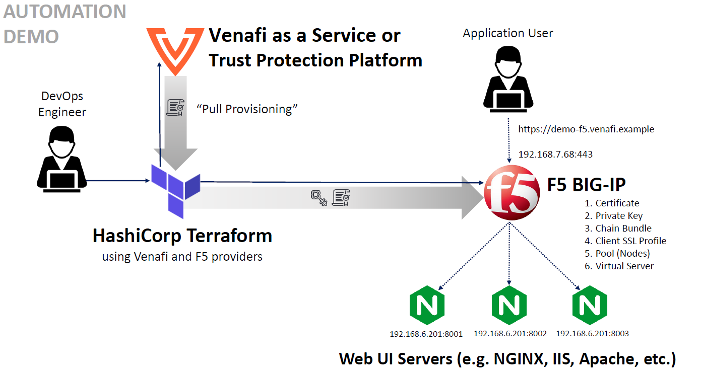

# Configuring secure application delivery using F5 BIG-IP and the _CyberArk Certificate Manager Provider for HashiCorp Terraform_

In this example, we'll show you how to better secure application delivery using _CyberArk Certificate Manager Provider for HashiCorp Terraform_ with your F5 BIG-IP instance. That will enable you to manage certificates more securely as part of the TLS termination process on your load balancer.

## Who should use this example?<!-- Suggest not using "Persona" as this is an UX term used more internally in software dev than a term that users would typically understand; while more techy people will use your example and might understand UX notion of personas, they are in this context a user. -->

The steps described in this example are typically performed by _DevOps engineers_ or _system administrators_. Generally, you'll need a basic understanding of F5 BIG-IP, CyberArk Certificate Manager, Self-Hosted or CyberArk Certificate Manager, SaaS, and the required permissions for completing the tasks described in the example.

## About this example 

In this example, we use Terraform's _infrastructure as code_ automation process with the _CyberArk Certificate Manager Provider_ to generate and install certificates as part of SSL termination on a Application Delevery Controller for F5 BIG-IP. We'll also utilize three HTTP servers contained in a cluster as the endpoints that are sending and receiving web traffic that's being managed by F5 BIG-IP.

> **TIP** Having at least some basic knowledge of the Bash command language is helpful, such as when you need to set your provider locally.

Later in this example, you'll generate a certificate for ``demo-f5-bigip.venafi.example`` using the _CyberArk Certificate Manager Provider for Hashicorp Terraform_ with either CyberArk Certificate Manager, Self-Hosted or CyberArk Certificate Manager, SaaS. Then after adding them to your F5 BIG-IP resources, you'll use them in the ADC node. And finally, you'll configure the "pool" for your ADC nodes.

> **NOTE** While we'll be using a ``Round robin`` balancing method in our ADC configuration, keep in mind that there are [other methods](https://www.f5.com/services/resources/glossary/load-balancer) that might be more suitable for your specific use case.



## About retrieving a certificate using the _CyberArk Certificate Manager Provider for Terraform_

> **BEST PRACTICE** In general, be careful when using self-signed certificates because of the inherent risks of no identity verification or trust control. The public and private keys are both held by the same entity. Also, self-signed certificates cannot be revoked; they can only be replaced. If an attacker has already gained access to a system, the attacker can spoof the identity of the subject. Of course, CAs can revoke a certificate only when they discover the compromise.

We'll be managing the following file structure:

```
./<your_workspace>/f5_bigip/
├── f5bigip.tf
├── main.tf
├── venafi.tf
└── terraform.tfvars
```

We provided the needed files in this folder, except for _terraform.tfvars_. The configuration of the file is customized by each user, which is why we provided _terraform.tfvars.example_ for each CyberArk Platform that you could use to set up your own configuration.

## Prerequisites

Before you continue, carefully review these prerequisites first:

- Verify that Terraform is installed correctly. [Look here for installation details.](https://learn.hashicorp.com/tutorials/terraform/install-cli).
- Verify that you have administrator access to either CyberArk Certificate Manager, Self-Hosted or CyberArk Certificate Manager, SaaS        
- If you're using CyberArk Certificate Manager, Self-Hosted and you do NOT have administrator access, you'll need to generate an access token from the [VCert CLI](https://github.com/Venafi/vcert/blob/master/README-CLI-PLATFORM.md), as described in [Trust between Terraform and CyberArk Certificate Manager, Self-Hosted](https://github.com/Venafi/terraform-provider-venafi#trust-between-terraform-and-trust-protection-platform)) in the _CyberArk Certificate Manager Provider for HashiCorp Terraform_ README.
- Verify that you have administrator access to your F5 BIG-IP instance
- Verify that you have three (3) web servers that are running your application; for this example, we'll use NGINX servers.

## Getting started 

Here are the steps we'll take as we go through this example:

1. Create your Terraform variables file
2. Set you main Terraform config file
3. Set your CyberArk Terraform config file
4. Set your F5 BIG IP Terraform config file
5. Apply your setup

>**NOTE** These steps reflect an example Terraform file structure and apply to this example only. Of course, you might be able to use a similar configuration, depending on your needs and preferences.

### Step 1: Create your Terraform variables file

The _terraform.tfvars_ configuration for F5 is divided by the following:

- Platform configuration (CyberArk Certificate Manager, SaaS or CyberArk Certificate Manager, Self-Hosted)
- Your F5 floating managment access
- The configuration for your site
- The F5 partition where your data is stored
- The Virtual IP and Port, which is the entry point for your traffic-management object of your virtual server
- The pool members are physical nodes on the network (NGINX servers, in this example)

First, we have to set the following variables depending on your platform that you are working on:

> **NOTE** [Learn how to set these variables and the `venafi_zone`](https://github.com/Venafi/terraform-provider-venafi#usage).

**CyberArk Certificate Manager, Self-Hosted**:
```JSON
tpp_url = "https://tpp.example"
bundle_path = "<bundle_path>"
access_token = "<access_token>"
```

**CyberArk Certificate Manager, SaaS**:
```JSON
venafi_api_key = "<venafi_api_key>"
```

And finally, configure your F5 infrastructure: 

>**NOTE** The values we use here are for illustration only; you should change them according to your own configutation.

```JSON
venafi_zone = "<venafi_zone>"

f5_address = "192.168.x.x"
f5_username = "your_f5_user"
f5_password = "your_password"

test_site_name = "demo-f5-bigip"
test_site_domain = "venafi.example"

f5_partition = "Demo"
f5_virtual_ip = "192.168.7.68"
f5_virtual_port = "443"
f5_pool_members = [ "192.168.6.201:8001", "192.168.6.201:8002", "192.168.6.201:8003" ]
```

### Step 2: Set up your main Terraform config file

1. Declare that the CyberArk and F5 BIG-IP providers are required:
    ```
    terraform {
        required_providers {
            venafi = {
                source = "venafi/venafi"
                version = "~> 0.11.0"
            }
            bigip = {
                source = "f5networks/bigip"
                version = "~> 1.5.0"
            }
        }
        required_version = ">= 0.13"
    }
    ```

2. Define your variables from _terraforms.vars_:

    **CyberArk Certificate Manager, Self-Hosted**:
    ```
    variable "tpp_url" {
        type = string
    }
    
    variable "bundle_path" {
        type = string
    }

    variable "access_token" {
        type = string
    }
    ```

    **CyberArk Certificate Manager, SaaS**:
    ```
    variable "venafi_api_key" {
        type = string
        sensitive = true
    }
    ```

    Then, define the following:
    ```
    variable "venafi_zone" {
        type = string
    }

    variable "test_site_name" {
        type = string
    }

    variable "test_site_domain" {
        type = string
    }

    variable "f5_address" {
        type = string
    }

    variable "f5_username" {
        type = string
    }

    variable "f5_password" {
        type = string
        sensitive = true
    }

    variable "f5_partition" {
        type = string
    }

    variable "f5_virtual_ip" {
        type = string
    }

    variable "f5_virtual_port" {
        type = string
    }

    variable "f5_pool_members" {
        type = list(string)
    }
    ```
### Step 3: Set up your CyberArk Terraform config file

1. Specify the connection and authentication settings for your CyberArk Certificate Manager Provider:

    **CyberArk Certificate Manager, Self-Hosted**:
    ```
    provider "venafi" {
        url          = var.tpp_url
        trust_bundle = file(var.bundle_path)
        access_token = var.access_token
        zone         = var.venafi_zone
    }
    ```

    **CyberArk Certificate Manager, SaaS**:
    ```
    provider "venafi" {
        api_key = var.venafi_api_key
        zone = var.venafi_zone
    }
    ```

2. Create a `venafi_certificate` _resource_ that will generate a new key pair and enroll the certificate needed by a _"tls_server"_ application:
    ```
    resource "venafi_certificate" "tls_server" {
        common_name = "${var.test_site_name}-${formatdate("YYYYMMDD-hhmmss", timestamp())}.${var.test_site_domain}"
        san_dns = [
            "${var.test_site_name}.${var.test_site_domain}"
        ]
        algorithm = "RSA"
        rsa_bits = 2048
        expiration_window = 720
    }
    ```

### Step 4: Set up your F5 BIG IP Terraform config file

1. Specify your F5 BIG-IP provider configuration:

    ```
    provider "bigip" {
        address  = var.f5_address
        username = var.f5_username
        password = var.f5_password
    }
    ```

2. Set your *asset_name* for your vars in `locals` ([check more about locals here](https://www.terraform.io/docs/language/values/locals.html)):

    ```
    locals {
        asset_name = "${var.test_site_name}.${var.test_site_domain}"
    }
    ```

3. Set your F5 BIG-IP resources as it gets the content from the _venafi_certificate_ resource:
    ```
    resource "bigip_ssl_key" "my_key" {
        name      = "${local.asset_name}.key"
        content   = venafi_certificate.tls_server.private_key_pem
        partition = var.f5_partition
    }

    resource "bigip_ssl_certificate" "my_cert" {
        name      = "${local.asset_name}.crt"
        content   = venafi_certificate.tls_server.certificate
        partition = var.f5_partition
    }

    resource "bigip_ssl_certificate" "my_chain" {
        name      = "${local.asset_name}-ca-bundle.crt"
        content   = venafi_certificate.tls_server.chain
        partition = var.f5_partition
    }
    ```

4. Create a resource to manage client SSL profiles on a BIG-IP from the F5 partition ([learn more about this configuration here](https://registry.terraform.io/providers/F5Networks/bigip/latest/docs/resources/bigip_ltm_profile_client_ssl)):

    ```
    resource "bigip_ltm_profile_client_ssl" "my_profile" {
        name           = "/${var.f5_partition}/clientssl_${var.test_site_name}"
        defaults_from  = "/Common/clientssl"
        cert_key_chain {
            name  = bigip_ssl_certificate.my_cert.name
            cert  = "/${var.f5_partition}/${bigip_ssl_certificate.my_cert.name}"
            key   = "/${var.f5_partition}/${bigip_ssl_key.my_key.name}"
            chain = "/${var.f5_partition}/${bigip_ssl_certificate.my_chain.name}"
        }
    }
    ```

5. Create your pool members' resources to manage membership in pools ([learn more about this configuration here](https://registry.terraform.io/providers/F5Networks/bigip/latest/docs/resources/bigip_ltm_pool_attachment)):

    ```
    resource "bigip_ltm_pool" "my_pool" {
        name                   = "/${var.f5_partition}/pool_${var.test_site_name}"
        load_balancing_mode    = "round-robin"
        minimum_active_members = 1
        monitors               = ["/Common/http"]
    }

    resource "bigip_ltm_pool_attachment" "my_pool_node" {
        pool     = bigip_ltm_pool.my_pool.name
        for_each = toset(var.f5_pool_members)
        node     = each.key
    }
    ```

6. Create your resource in order to create your virtual server for managing your F5 partition ([check more about this configuration in here](https://registry.terraform.io/providers/F5Networks/bigip/latest/docs/resources/bigip_ltm_virtual_server)):

    ```
    resource "bigip_ltm_virtual_server" "my_virtual_server" {
        name                       = "/${var.f5_partition}/vs_${var.test_site_name}"
        description                = "Provisioned by Terraform"
        destination                = var.f5_virtual_ip
        port                       = var.f5_virtual_port
        client_profiles            = [bigip_ltm_profile_client_ssl.my_profile.name]
        source_address_translation = "automap"
        pool                       = bigip_ltm_pool.my_pool.name
    }
    ```

### Step 5: Apply your setup

Finally, run `terraform init`, ``terraform plan`` and ``terraform apply`` to apply your configuration changes. Then you should be able to log into your F5 partition in `192.168.x.x` using ``<your_f5_user>:<your_password>``.

If done correctly, you should see an output similar to the following:

[](https://asciinema.org/a/fKmvGRMCGxSaLN6EodmedsRpg)
To tear down your F5 partition execute `terraform destroy`, then you should see an output like this:

[](https://asciinema.org/a/V7TthUjHaejww5miuUbAnmyQS)

## What's next

After you've successfully implemented this example, consider the following tips:
<details>
    <summary><b>
        What happens when certificates expire? How do they get renewed? (click to expand)
    </b></summary>

**IMPORTANT!** When your certificate expires, the chances that users of your application will experience an outage increases significantly. When an outage occures, most web browsers automatically warn users. Also, your ADC provider might turn off the appliances when any of the certificates of the appliances it points to expire ([here's an example](https://www.ibm.com/support/pages/one-expired-certificate-brings-down-all-certificates-datapower-validation-credential)).

To renew a certificate, you'll need to generate a new [CSR](https://www.globalsign.com/en/blog/what-is-a-certificate-signing-request-csr). Once the certificate is ready, the CA will deliver it to you. Then you can install it on your appliance.
</details>

<details>
    <summary><b>
        How do certificates get validated? (click to expand)
    </b></summary>
    
Your application's web server sends a copy of the SSL certificate to the browser. The browser validates the certificate against a list of certificate authorities that are publicy trusted. The browser then returns a message indicating whether the certificate was signed by a trusted CA. Finally, the web server starts an SSL-encrypted session with the web browser. You can [learn more about this here](https://www.ssl.com/article/browsers-and-certificate-validation/).
</details>
