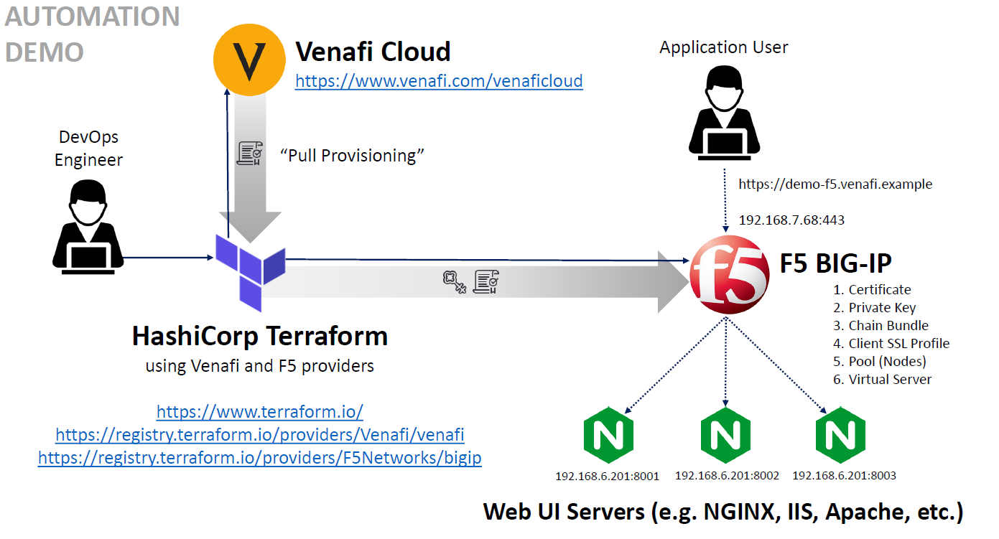

# Build a set of servers with a balancer using F5

This example will guide you in mounting a load balancer server with 3 pool members of an f5 BIG-IP instance and make certificates for those sites using venafi's product terraform implentation in oder to provide [SSL termination](https://www.techwalla.com/articles/what-is-ssl-termination).

## Personas

The steps described in this example are typically performed by a **System Administrator** or a **DevOps engineer**.

## Scenario

In order to increase reliability and capacity of applications, a load balancer manages web traffic of your server application into child nodes in order to reduce the "weight load" of those applications.

For this example's scenario, the load balancer that will be used is F5 BIG-IP for managing 3 HTTP servers as child nodes where the web traffic will be distributed.

## Solution

Using terraform "infrastructure as code" automation process for generating and installing a certificate and adding the corresponding configuration to achieve a SSL termination for the load balancer handling a cluster of 3 HTTP servers.

We will divide the process in the following steps:

> **_Note:_**  This steps are providing a suggested terraform file structure for this example only but you could still use the same configuration as your liking.

1. Create your terraform variables file
2. Set you main terraform config file
3. Set your venafi terraform config file
4. Set your f5 BIG IP terraform config file
5. Apply your setup

## Prerequisites

[Install terraform](../README.md)

## Scenario Introduction

As for this example scenario, you'll generate a certificate for ``demo-f5-bigip.venafi.example`` using Venafi Provider for Hashicorp terraform using Venafi Cloud - DevOps Accelerate. Thus adding them to your F5 BIG-IP resources, then use them in the load balancer Node, and, finally, you'll configure the "pool" for you load balancer nodes.

> **_Note:_** As for the balancer we will be using ``Round robin`` balancing method but keep in mind there are other methods that may be more suitable for your use case (https://www.f5.com/services/resources/glossary/load-balancer)



# Retrieving certificate using Venafi Provider for Terraform

> **_Note:_** The sole purpose of the credentials used in this example is illustrative, in a real life scenario they must be considered as **weak** and **insecure**.

We'll be managing the following file structure:

```
./<your_workspace>f5_example/
├── f5bigip.tf
├── main.tf
├── venafi.tf
└── terraform.tfvars
```

We provided the need files in this folder except for **terraform.tfvars**. The configuration of the file is custom by each user, hence we provided a **terraform.tfvars.example** that you could use to set your own configuration.

## Step 1: Create your terraform variables file

The **terraform.tfvars** configuration for F5 is divided by:

- Venafi Cloud (DevOpsAccelerate) configuration
- Your F5 floating managment access
- The configuration for your site
- The F5 partition where your data is stored
- The Virtual IP and Port which is the entry point for your traffic-management object of your virtual server
- The pool memebers are physical nodes on the network (NGINX servers for this example).

```JSON
venafi_api_key = "xxxxxxxx-xxxx-xxxx-xxxx-xxxxxxxxxxxx"
venafi_zone = "zzzzzzzz-zzzz-zzzz-zzzz-zzzzzzzzzzzz"

f5_address = "192.168.x.x"
f5_username = "your_f5_user"
f5_password = "your_password"

test_site_name = "demo-f5-bigip"
test_site_domain = "venafi.example"

f5_partition = "Demo"
f5_virtual_ip = "192.168.7.68"
f5_virtual_port = "443"
f5_pool_members = [ "192.168.6.201:8001", "192.168.6.201:8002", "192.168.6.201:8003" ]
```

## Step 2: Set you main terraform config file

1. Declare that the Venafi and BIGIP providers are required:
    ```
    terraform {
        required_providers {
            venafi = {
            source = "venafi/venafi"
            version = "~> 0.10.0"
            }
            bigip = {
            source = "f5networks/bigip"
            version = "~> 1.5.0"
            }
        }
        required_version = ">= 0.13"
    }
    ```

2. Define you variables from **terraforms.vars**

    ```
    variable "venafi_api_key" {
        type = string
        sensitive = true
    }

    variable "venafi_zone" {
        type = string
    }

    variable "test_site_name" {
        type = string
    }

    variable "test_site_domain" {
        type = string
    }

    variable "f5_address" {
        type = string
    }

    variable "f5_username" {
        type = string
    }

    variable "f5_password" {
        type = string
        sensitive = true
    }

    variable "f5_partition" {
        type = string
    }

    variable "f5_virtual_ip" {
        type = string
    }

    variable "f5_virtual_port" {
        type = string
    }

    variable "f5_pool_members" {
        type = list(string)
    }
    ```
## Step 3: Set your venafi terraform config file

1. Specify the connection and authentication settings for the venafi provider (Venafi Cloud - DevOps Accelerate for this example):
    ```
    provider "venafi" {
        api_key = var.venafi_api_key
        zone = var.venafi_zone
    }
    ```

2. Create a `venafi_certificate` **resource** that will generate a new key pair and enroll the certificate needed by a _"tls_server"_ application:
    ```
    resource "venafi_certificate" "tls_server" {
        common_name = "${var.test_site_name}-${formatdate("YYYYMMDD-hhmmss", timestamp())}.${var.test_site_domain}"
        san_dns = [
            "${var.test_site_name}.${var.test_site_domain}"
        ]
        algorithm = "RSA"
        rsa_bits = 2048
        expiration_window = 720
    }
    ```

## Step 4: Set your f5 BIG IP terraform config file

1. Set your BIG-IP provider config:

    ```
    provider "bigip" {
        address  = var.f5_address
        username = var.f5_username
        password = var.f5_password
    }
    ```

2. Set your asset_name for your vars in `locals`, remeber that locals<sup>[1](https://www.terraform.io/docs/language/values/locals.html)</sup> are values that multiple times within a module without repeating it:

    ```
    locals {
        asset_name = "${var.test_site_name}.${var.test_site_domain}"
    }
    ```

3. Set your F5 BIG_IP resources as it gets the content from the venafi_certificate resource:
    ```
    resource "bigip_ssl_key" "my_key" {
        name      = "${local.asset_name}.key"
        content   = venafi_certificate.tls_server.private_key_pem
        partition = var.f5_partition
    }

    resource "bigip_ssl_certificate" "my_cert" {
        name      = "${local.asset_name}.crt"
        content   = venafi_certificate.tls_server.certificate
        partition = var.f5_partition
    }

    resource "bigip_ssl_certificate" "my_chain" {
        name      = "${local.asset_name}-ca-bundle.crt"
        content   = venafi_certificate.tls_server.chain
        partition = var.f5_partition
    }
    ```

4. Create a resource to manages client SSL profiles on a BIG-IP from the F5 partion<sup>[2](https://registry.terraform.io/providers/F5Networks/bigip/latest/docs/resources/bigip_ltm_profile_client_ssl)</sup>:

    ```
    resource "bigip_ltm_profile_client_ssl" "my_profile" {
        name           = "/${var.f5_partition}/clientssl_${var.test_site_name}"
        defaults_from  = "/Common/clientssl"
        cert_key_chain {
            name  = bigip_ssl_certificate.my_cert.name
            cert  = "/${var.f5_partition}/${bigip_ssl_certificate.my_cert.name}"
            key   = "/${var.f5_partition}/${bigip_ssl_key.my_key.name}"
            chain = "/${var.f5_partition}/${bigip_ssl_certificate.my_chain.name}"
        }
    }
    ```

5. Create your pool members resources to manage memebership in pools<sup>[3](https://registry.terraform.io/providers/F5Networks/bigip/latest/docs/resources/bigip_ltm_pool_attachment)</sup>:

    ```
    resource "bigip_ltm_pool" "my_pool" {
        name                   = "/${var.f5_partition}/pool_${var.test_site_name}"
        load_balancing_mode    = "round-robin"
        minimum_active_members = 1
        monitors               = ["/Common/http"]
    }

    resource "bigip_ltm_pool_attachment" "my_pool_node" {
        pool     = bigip_ltm_pool.my_pool.name
        for_each = toset(var.f5_pool_members)
        node     = each.key
    }
    ```

6. Create you resource in order to create your virtual server to manage your F5 partion<sup>[4](https://registry.terraform.io/providers/F5Networks/bigip/latest/docs/resources/bigip_ltm_virtual_server)</sup>:

    ```
    resource "bigip_ltm_virtual_server" "my_virtual_server" {
        name                       = "/${var.f5_partition}/vs_${var.test_site_name}"
        description                = "Provisioned by Terraform"
        destination                = var.f5_virtual_ip
        port                       = var.f5_virtual_port
        client_profiles            = [bigip_ltm_profile_client_ssl.my_profile.name]
        source_address_translation = "automap"
        pool                       = bigip_ltm_pool.my_pool.name
    }
    ```

## Step 5: Apply your setup

Finally execute `terraform init`, ``terraform plan`` and ``terraform apply`` to apply your configuration changes. Then you should be able to log in your F5 partion in `192.168.x.x` using ``<your_f5_user>:<your_password>``.

To tear down your F5 partion execute `terraform destroy`.

# References

1. https://www.terraform.io/docs/language/values/locals.html
2. https://registry.terraform.io/providers/F5Networks/bigip/latest/docs/resources/bigip_ltm_profile_client_ssl
3. https://registry.terraform.io/providers/F5Networks/bigip/latest/docs/resources/bigip_ltm_pool_attachment
4. https://registry.terraform.io/providers/F5Networks/bigip/latest/docs/resources/bigip_ltm_virtual_server
