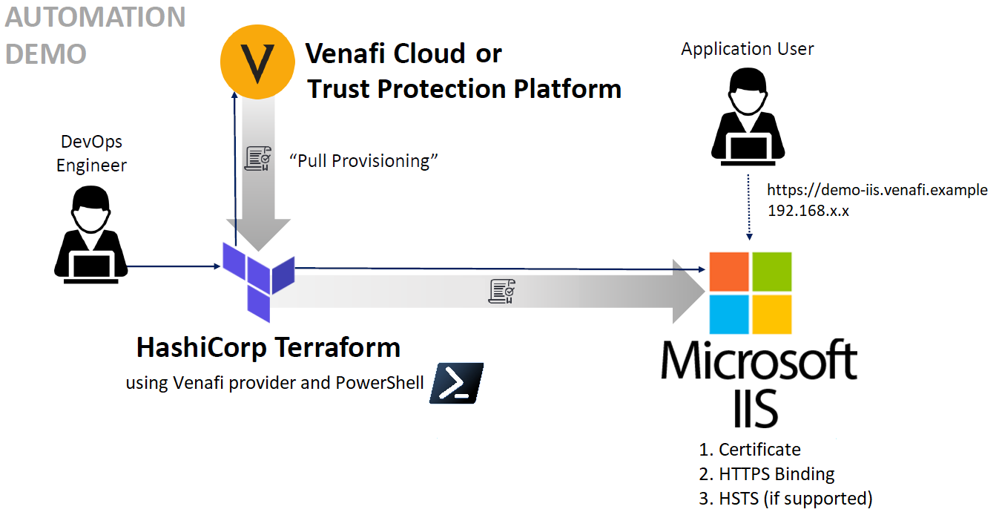

# Configuring secure web applications using Microsoft IIS and the Venafi Provider for HashiCorp Terraform

In this example, we'll show you how to better secure communication between your [Microsoft Internet Information Services](https://www.iis.net) (IIS) application and its users using the *Venafi Provider for HashiCorp Terraform*. Adding Venafi allows you to automate certificate management and enable the TLS protocol on your web server.

## Who should use this example?

The steps described in this document are typically performed by _DevOps engineers_ or _system administrators_. Generally, you'll need a basic understanding of IIS, PowerShell, Venafi Trust Protection Platform or Venafi as a Service, and the required permissions for completing the tasks described in the example.

## About this example

In this Infrastructure as Code example we use [HashiCorp Terraform](https://terraform.io/) with the _Venafi Provider for Terraform_  to automate the process of requesting, retrieving and installing a certificate as part of enabling the TLS protocol for an IIS server.

Later in this example, you'll generate a certificate for `demo-iis.venafi.example` using Terraform and the `venafi_certificate` resource to request and retrieve it from either *Venafi Trust Protection Platform* (TPP) or *Venafi as a Service* (VaaS). Then, using PowerShell scripting, you'll import the certificate with its private key into the certificate store on the target Windows server and configure IIS to use the certificate for HTTPS. You'll be able to set a Server Name Indication (SNI) and enable HTTP Strict-Transport-Security (HSTS) if supported by the version of Windows to which you are provisioning (i.e. Windows Server 2019 or higher).

> **NOTE** Since there is no native or third-party support for Microsoft IIS with Terraform, we'll be using Terraform's provisioners and PowerShell to configure IIS so bear in mind that means we won't be managing data using Terraform's state.  More details in the next section.



### Why Provisioners?

Presently there doesn't exist a native or third-party provider for Microsoft IIS with Terraform which means no resource with which to save our desired state:

> "_Terraform relies on plugins called "providers" to interact with remote systems._
> <br><br>_Terraform configurations must declare which providers they require, so that Terraform can install and use them. Additionally, some providers require configuration (like endpoint URLs or cloud regions) before they can be used._"

(see: https://www.terraform.io/docs/language/providers/configuration.html)

But no worries! This is where **provisioners** and the **Null resource** features can help.

Generally, provisioners should be a last resort since they don't allow Terraform to track the internal state of an IIS web server like other configuration management software including Ansible and Puppet. Provisioners can help you to run post deployment configuration, though. In our example scenario, we'll handle state fully through logic in our PowerShell scripts.

Due to lack of a provider for IIS we will also have to generate a `null_resource` to handle all sequential provisioning operations that will run on the target Windows server.

#### Provisioners

This feature allow us to manipulate infrastructure or customize configuration after the resource has been deployed. They are only meant to run one time after a resource has been created, so whenever you need to update your configuration you probably will need to add a value that forces an update when you apply the Terraform plan.

#### Null Resource

Instances of `null_resource` will allow us provision files and execute commands that administer IIS. Unlike a normal resource, and since they are not attached to a provider, they don't actually do anything. They cannot save state so the PowerShell scripts should be written to handle different states they may encounter.

## Prerequisites

To perform the tasks described in this example, you'll need:

- A server running Windows Server 2016 (or higher) with:
  - IIS installed and a web site created without an HTTPS binding.
  - WinRM access over HTTPS and NTLM authentication enabled.
  - A user account that has administrative access.
- A Linux system with Terraform is installed [as described here](https://learn.hashicorp.com/tutorials/terraform/install-cli).
- Access to request certificates from either **Venafi Trust Protection Platform** or **Venafi as a Service**.      
  - If you are working with **Trust Protection Platform** obtain the `access_token` using the [VCert CLI](https://github.com/Venafi/vcert/blob/master/README-CLI-PLATFORM.md).

## Getting started 

Here are the steps we'll take as we go trough this example:

1. Create your Terraform variables file, `terraform.tfvars`
2. Create a `main.tf` file to declare variables and the Venafi provider for Terraform
3. Create a `venafi.tf` file to specify how to connect to Venafi and the details of the certificate to request
4. Create an `iis.tf` file to define the operations Terraform will perform and a `plan.ps1` (PowerShell) script that will make the changes to Windows and IIS
5. Apply the Terraform configuration

All files are available for download and unless you want different behavior than this example, only the `terraform.tfvars` requires editing.

### Terraform Variables File

The _terraform.tfvars_ configuration for IIS is divided into three sections:

- **Venafi Configuration:**
  - Trust Protection Platform:
    ```JSON
    tpp_url = "https://tpp.venafi.example"
    bundle_path = "/path-to/trust-bundle.pem"
    access_token = "p0WTt3sDPbzm2BDIkoJROQ=="
    venafi_zone = "My IIS Application"
    ```
    
  - Venafi as a Service:
  
    ```JSON
    vaas_api_key = "xxxxxxxx-xxxx-xxxx-xxxx-xxxxxxxxxxxx"
    venafi_zone = "My IIS Application\\Enterprise Issuing Template"
    ```
  
  > **NOTE:** Credentials used in this example are for demonstration purposes only. You should use stronger credentials. 
  
- **Windows Server Details:**

  ```JSON
  admin_user = "your_user"
  admin_password = "your_password"
  host = "my-windows-server.example.com"
  winrm_port = "5986"
  winrm_ca_trust_path = "/path-to/trust-bundle.pem" // (optional)
  ```
  - `admin_user`: the Windows administrative user; can be local or domain since NTLMv2 authentication is being used
  - `admin_password`: the Windows administrative user's password
  - `host`: DNS resolvable FQDN that matches the CN of the WinRM server certificate
  - `winrm_port`: port for the WinRM over HTTPS connection (defaults to 5986)
  - `winrm_ca_trust_path` (optional): relative or absolute path of a PEM trust bundle that contains the root CA certificate of the chain that signed the WinRM server certificate (optional, only needed if the root CA certificate is not present in the management server's trust store).

  > **NOTE**: We are using WinRM over HTTPS with NTLMv2 authentication as that is the best combination of simplicity and security for this use case

- **IIS Web Site Configuration:**

	```JSON
	website_name = "Default Web Site"
	binding_ip = "*"
	binding_port = "443"
	// ssl_flag = true // (optional)
	```
	- `binding_ip`: IP address of the IIS web site binding
	- `binding_port`: TCP port of the IIS web site binding
	- `ssl_flag` (optional): if not present, IIS web site binding will not use SNI; if present, IIS web site binding will use SNI and be optional for clients if the value is `false` and required if the value is `true` 

	And finally the name and domain by which HTTPS clients will access the IIS web site: 

	```JSON
	test_site_name = "demo-iis"
	test_site_domain = "venafi.example"
	```

Click [here](./terraform.tfvars.example) to view the complete `terraform.tfvars.example` file.

### Terraform Configuration File

There is no order of precedence for variables or files with Terraform which allows us to establish our own conventions. So we will declare all of the variables needed for the entire example including providers, input variables, output variables, and local variables in the `main.tf`.

```
terraform {
    required_providers {
        venafi = {
        source = "venafi/venafi"
        version = "~> 0.12.0"
        }
    }
    required_version = ">= 0.15"
}
```

We are setting 0.15 as minimum version since we are also using the [sensitive](https://www.terraform.io/docs/language/functions/sensitive.html) option to make sure secrets are not output to the console.

Click [here](./main.tf) to view the complete `main.tf` example file.

### Venafi Configuration File

In the  `venafi.tf` we will specify how to connect to Venafi and get our certificate from the `venafi_certificate` resource in the PKCS#12 format needed to import the certificate into the Windows certificate store.

```
provider "venafi" {
    url          = var.tpp_url != "" && var.vaas_api_key == "" ? var.tpp_url : null
    trust_bundle = var.bundle_path != "" && var.vaas_api_key == "" ? file(var.bundle_path) : null
    access_token = var.access_token != "" && var.vaas_api_key == "" ? var.access_token : null
    api_key = var.vaas_api_key != "" && length(compact((local.list_tpp_values))) == 0 ? var.vaas_api_key : null
    zone         = var.venafi_zone
}
```
The above code block is written such that it will work for either TPP or VaaS based on which values you include in your `terraform.vars` file. The values `tpp_url`, `bundle_path` and `access_token` are the supported if we are connecting to TPP, and `vaas_api_key` for VaaS.

> NOTE: If you are executing the Terraform plan from Windows with PowerShell you need to make the following changes in the provisioner:

```
// Adding our p12 certificate our current path to upload later to our desired resource
provisioner "local-exec" {
    interpreter = ["PowerShell", "-Command"]
    command = "'${venafi_certificate.tls_server.pkcs12}' > ${local.asset_name}.p12"
}
```

Click [here](./venafi.tf) to view the complete `venafi.tf` example file.

### IIS Configuration Files

The `iis.tf` file handles the configuration necessary to provision the PKCS#12 certificate and subsequently to execute the `plan.ps1` PowerShell script that binds the certificate to the IIS web site and enables HTTPS.

-  **`iis.tf`**

    ```
    resource "null_resource" "remote-exec-windows" {
    triggers = {
        always_run = timestamp()
        admin_user = var.admin_user
        admin_password = sensitive(var.admin_password)
        host = var.host
        winrm_port = var.winrm_port
        execute_destroy = local.execute_destroy
        winrm_ca_trust_path = var.winrm_ca_trust_path
    }
    depends_on = [
        venafi_certificate.tls_server
    ]
    ...
    }
    ```
    We are specifying the `always_run = timestamp()` trigger to make sure our provisioners are executed every time our configuration is run.  Other trigger variables are declared as Terraform variables so they can be used upon the _terraform-destroy_ event (see https://github.com/hashicorp/terraform/issues/23679#issuecomment-886020367).

    ```
    connection {
        type     = "winrm"
        user     = var.admin_user
        password = var.admin_password
        host     = var.host
        insecure = false
        use_ntlm = true
        cacert   = var.winrm_ca_trust_path != "" ? file(var.winrm_ca_trust_path) : null
        port     = var.winrm_port
        https    = true
        timeout  = "30s"
    }
    ```

    For our provisioner's connection block we are using Windows server variables from our `terraform.tfvars` file.  The `use_ntlm ` variable is set to `true` to provide a necessary layer of security when authenticating our connection since without it NTLM is vulnerable to man-in-the-middle attacks (see https://docs.microsoft.com/en-us/troubleshoot/windows-server/windows-security/ntlm-user-authentication).

- **`plan.ps1`**

    This script is composed of two main functions: `init` and `destroy`.  The `init` function is responsible for IIS administration and performs the following creation operations:

    - Adds a certificate to Windows certificate store
    - Adds an HTTPS binding to the certificate to the IIS web site
    - Sets the HSTS configuration to redirect HTTP requests to HTTPS (Windows Server 2019 and higher)
    
    The `destroy` function is meant to run upon the destruction of the `null_resource`, thus it performs the reverse operations as the `init` function:
    
    - Removes the HTTPS binding to the certificate from the IIS web site
    - Removes the certificate from the Windows certificate store
    - Revert HSTS configuration to default values (Windows Server 2019 and higher)

Click [here](./iis.tf) to download the complete `iis.tf` example file and (here](./plan.ps1) to download the complete `plan.ps1` example PowerShell script.


### Apply the Terraform Configuration

Finally, apply your Terraform configuration by running the following sequence of commands:

1.  `terraform init`,
2. `terraform plan`
3.  `terraform apply`

After doing so, log into your target Windows server and review the results in IIS.  Then open a web browser and enter the DNS resolvable name of the web site (e.g. "https://demo-iis.venafi.example") to see it is now secured with TLS!  You can also add the name of the site and the IP address of the binding to your local hosts file to test if it isn't DNS resolvable.  Lastly, you can print `my_certificate` output variable using `terraform show`.

## What's Next?

After you've successfully implemented this example, consider the following tips:

<details>
    <summary><b>
        What happens when my certificate expires? How does it get renewed? (click to expand):
    </b></summary>

**IMPORTANT!** When your certificate expires, users of your application will be advised they should no longer trust it.  We refer to this as an "outage" because machines will not proceed with connections when this occurs. For example, if you are using an ADC to manage traffic between clients and your application, the ADC may stop sending traffic to them if their certificates have expired (see https://www.ibm.com/support/pages/one-expired-certificate-brings-down-all-certificates-datapower-validation-credential).

The Venafi provider for Terraform has renewal intelligence built-in.  Unfortunately, most Terraform providers do not and that's especially true for the IIS use case since there is no IIS provider.  To renew a certificate using Terraform, you'll first need to execute `terraform destroy` and then `terraform apply` again to request and install a new certificate.
</details>

<details>
    <summary><b>
        How do certificates get validated? (click to expand)
    </b></summary>

Your application's web server (IIS) sends a copy of the certificate to the web browser.  It also sends any "intermediate" CA certificates needed to link the server's certificate to the root CA. The browser validates the certificate against a list of certificate authorities that are present in its trust store. The browser then returns a message indicating whether the certificate was signed by a trusted CA. Finally, if trusted, the web server starts an TLS-encrypted session with the web browser. You can [learn more about this here](https://www.ssl.com/article/browsers-and-certificate-validation/).
</details>
